# CNCF Certification Resources Hub

[](https://astro.build)
[](https://opensource.org/licenses/MIT)

A comprehensive resource hub for CNCF (Cloud Native Computing Foundation) certification preparation. Track your progress, access study materials, and achieve your Kubestronaut status.

## Features

- **15+ CNCF Certifications** - Complete coverage of all certifications
- **Multi-language Support** - English, Spanish, and Portuguese
- **Achievement Tracking** - Kubestronaut and Golden Kubestronaut progress
- **Interactive Cards** - Flip cards showing exam domains and weights
- **Responsive Design** - Desktop, tablet, and mobile optimized
- **Modern UI** - Clean interface with Kubernetes-themed styling
- **Study Resources** - Curated links to official docs and practice exams

## Getting Started

[](https://github.com/jeanlopezxyz/cncf-certification-hub/actions/workflows/deploy.yml)
[](https://github.com/jeanlopezxyz/cncf-certification-hub/actions/workflows/ci-enhanced.yml)

### Prerequisites

- Node.js 18+
- npm 8+

### Installation

```bash
# Clone the repository
git clone https://github.com/jeanlopezxyz/cncf-certification-hub.git
cd cncf-certification-hub

# Install dependencies
npm install

# Start development server
npm run dev
```

### Available Scripts

```bash
npm run dev        # Start development server
npm run build      # Build for production
npm run preview    # Preview production build
npm run clean      # Clean build artifacts
```

## 📁 Project Structure

```
src/
├── components/       # React components
│   ├── achievements/ # Achievement tracking
│   ├── certifications/ # Certification cards and grids
│   ├── hero/        # Landing page hero
│   ├── icons/       # SVG icons
│   ├── language/    # Language selector
│   ├── performance/ # Lazy loading utilities
│   ├── security/    # Error boundaries
│   └── sidebar/     # Navigation sidebar
├── config/          # App configuration
├── data/           
│   └── certifications/ # Certification data (15+ certs)
├── i18n/           
│   └── locales/    # Translations (en, es, pt)
├── layouts/        # Astro layouts
├── pages/          # File-based routing
│   ├── index.astro # Homepage
│   ├── es/        # Spanish pages
│   └── pt/        # Portuguese pages
├── styles/         # Global styles
├── types/          # TypeScript definitions
└── utils/          # Utility functions
```

## Deployment

### GitHub Pages

The project is configured for automatic deployment to GitHub Pages.

1. Push to `main` branch
2. GitHub Actions automatically builds and deploys
3. Access at: `https://jeanlopezxyz.github.io/cncf-certification-hub`

## CI/CD Pipeline

### Workflow Overview

This project uses a secure, two-stage pipeline that ensures code quality before deployment:

```mermaid
graph LR
    A[Push to main] --> B[CI - Community Project]
    C[Pull Request] --> B
    B --> D{CI Passes?}
    D -->|✅ Success| E[Deploy to GitHub Pages]
    D -->|❌ Failure| F[Block Deploy]
    E --> G[Site Updated]
```



### Pipeline Stages

#### Stage 1: Continuous Integration (8 parallel jobs)

| Job | Purpose | Tools |
|-----|---------|-------|
| **Quality** | Code standards and formatting | TypeScript, ESLint, Prettier |
| **Test** | Unit test execution | Vitest (when tests added) |
| **Build** | Cross-platform compilation | Node.js 18 & 20 |
| **Lighthouse** | Performance and accessibility | Google Lighthouse |
| **Security** | Vulnerability scanning | npm audit, CodeQL |
| **Link Check** | Documentation link validation | markdown-link-check |
| **SonarCloud** | Code quality analysis | SonarCloud (optional) |
| **Notify** | Pipeline results summary | GitHub Actions |

#### Stage 2: Deployment

- **Trigger**: Only after CI completes successfully
- **Actions**: Build static site, optimize assets, deploy
- **Target**: GitHub Pages at production URL
- **Rollback**: Automatic on deployment failure

### Execution Scenarios

| Scenario | CI Execution | Deploy Execution | Flow |
|----------|-------------|------------------|------|
| **Push to main (code changes)** | Yes | Yes (if CI passes) | Sequential |
| **Push to main (docs only)** | No | No (CI trigger required) | Manual only |
| **Pull Request** | Yes | No | Validation only |
| **Merge PR** | Yes | Yes (if CI passes) | Sequential |
| **Failed CI** | Yes | No (blocked) | No deployment |

### Manual Deployment

For documentation-only changes or emergency deployments:

1. Navigate to the **Actions** tab in GitHub
2. Select **Deploy to GitHub Pages** workflow
3. Click **Run workflow** button
4. Choose target branch and confirm execution

### Pipeline Benefits

- **Security**: Prevents broken code from reaching production
- **Performance**: Validates site performance with Lighthouse scores
- **Quality**: Automated code review and standards enforcement
- **Accessibility**: WCAG compliance validation
- **Multi-platform**: Testing across multiple Node.js versions
- **Reliability**: Automatic rollback mechanisms on deployment failure

## Supported Certifications

### Kubernetes (Kubestronaut Path)
- **KCNA** - Kubernetes and Cloud Native Associate
- **KCSA** - Kubernetes and Cloud Native Security Associate
- **CKA** - Certified Kubernetes Administrator
- **CKAD** - Certified Kubernetes Application Developer
- **CKS** - Certified Kubernetes Security Specialist

### CNCF Projects
- **PCA** - Prometheus Certified Associate
- **ICA** - Istio Certified Associate
- **CCA** - Cilium Certified Associate
- **CAPA** - Certified Argo Project Associate
- **CGOA** - Certified GitOps Associate
- **KCA** - Kyverno Certified Associate
- **OTCA** - OpenTelemetry Certified Associate
- **CBA** - Backstage Certified Associate
- **CNPA** - Cloud Native Platform Associate

### Linux Foundation
- **LFCS** - Linux Foundation Certified System Administrator

## Achievement Programs

**Kubestronaut**: Complete all 5 Kubernetes certifications (KCNA, KCSA, CKA, CKAD, CKS)

**Golden Kubestronaut**: Complete all 15+ CNCF certifications

## Contributing

We welcome contributions from the community! Here's how you can help:

### Adding Study Resources

To add new tutorials, documentation, or study resources for any certification:

1. **Fork the repository**
2. **Edit the certification data file** in `src/data/certifications/[cert-name].ts`
3. **Add your resource** to the appropriate section:

```typescript
resources: {
  // Official certification page (single URL)
  official: 'https://www.cncf.io/certification/kcna/',
  
  // GitHub repositories (array of URLs)
  github: [
    'https://github.com/existing-repo',
    'https://github.com/your-awesome-repo'  // Add your repo
  ],
  
  // Practice exams and labs (array of URLs)
  practice: [
    'https://existing-practice-exam',
    'https://your-practice-resource'  // Add practice exam
  ],
  
  // Books (array of book objects)
  books: [
    {
      title: 'Your Book Title',
      url: 'https://link-to-book',
      author: 'Author Name',
      description: 'Brief description of the book',
      isPaid: true,  // or false
      format: 'pdf',  // or 'paperback', 'ebook'
      year: 2024,
      difficulty: 'beginner'  // or 'intermediate', 'advanced'
    }
  ],
  
  // Online courses (array of course objects)
  courses: [
    {
      title: 'Course Name',
      url: 'https://course-link',
      author: 'Instructor Name',
      description: 'What the course covers',
      isPaid: false,  // or true
      duration: '10 hours',
      difficulty: 'beginner',
      rating: 4.5  // optional
    }
  ],
  
  // Videos and playlists (array of video objects)
  videos: [
    {
      title: 'Video Title',
      url: 'https://youtube.com/watch?v=...',
      author: 'Channel Name',
      description: 'Video content description',
      isPaid: false,
      duration: '2 hours',
      difficulty: 'beginner'
    }
  ],
  
  // Documentation and guides (array of doc objects)
  documentation: [
    {
      title: 'Documentation Title',
      url: 'https://docs-link',
      description: 'What this documentation covers',
      isPaid: false
    }
  ],
  
  // Blog posts and articles (array of blog objects)
  blogs: [
    {
      title: 'Blog Post Title',
      url: 'https://blog-link',
      author: 'Author Name',
      description: 'Summary of the blog post',
      isPaid: false
    }
  ],
  
  // Communities and forums (array of community objects)
  communities: [
    {
      title: 'Community Name',
      url: 'https://community-link',
      description: 'Description of the community',
      isPaid: false
    }
  ],
  
  // Tools and playgrounds (array of tool objects)
  tools: [
    {
      title: 'Tool Name',
      url: 'https://tool-link',
      description: 'What the tool does',
      isPaid: false
    }
  ]
}
```

4. **Submit a Pull Request** with a clear description of your additions

### Contribution Guidelines

- Ensure resources are free or clearly marked if paid
- Verify links are working and relevant
- Add resources in the appropriate category (official/github/practice)
- Include a brief description in your pull request

### Reporting Issues

Found a broken link or outdated information? [Open an issue](https://github.com/jeanlopezxyz/cncf-certification-hub/issues) and we'll address it promptly.

## Technology Stack

- **Astro 5** - Static site generator with file-based routing
- **React 19** - Interactive components with TypeScript
- **Tailwind CSS 3** - Utility-first styling framework
- **TypeScript 5** - Static type checking
- **Vite** - Fast build tool and development server

## License

This project is licensed under the MIT License. See the [LICENSE](LICENSE) file for details.

## Contact

- **Email**: jeanlopez@linux.com
- **Issues**: [GitHub Issues](https://github.com/jeanlopezxyz/cncf-certification-hub/issues)

## Additional Resources

- [CNCF Official Website](https://www.cncf.io/)
- [Kubernetes Documentation](https://kubernetes.io/docs/)
- [Linux Foundation Training](https://training.linuxfoundation.org/)

---

<p align="center">Made with care for the Cloud Native Community</p>