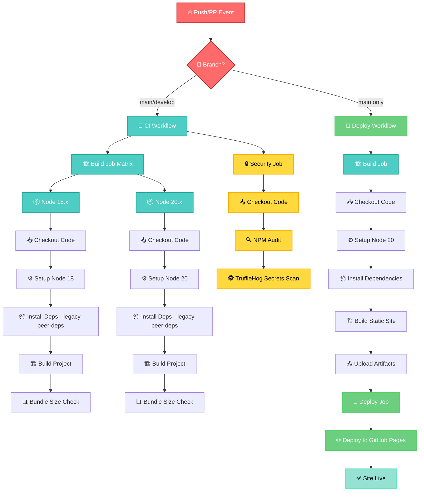

# 🚀 GitHub Actions CI/CD Pipeline - CNCF Certification Hub

## 📊 Diagrama de Flujo Completo



## 🔄 Flujo de Workflows Detallado

### 1. **CI Workflow** (`ci.yml`)
```
Triggers: Push/PR → main, develop branches

┌─────────────────────────────────────────────────┐
│  🏗️  BUILD JOB (Matrix Strategy)                │
├─────────────────────────────────────────────────┤
│  Node 18.x        │        Node 20.x           │
│                   │                            │
│  ✅ Checkout       │  ✅ Checkout                │
│  ⚙️  Setup Node    │  ⚙️  Setup Node             │
│  📦 npm ci         │  📦 npm ci                  │
│  🏗️  npm run build │  🏗️  npm run build          │
│  📊 Bundle Size    │  📊 Bundle Size             │
└─────────────────────────────────────────────────┘

┌─────────────────────────────────────────────────┐
│  🔒 SECURITY JOB (Parallel)                    │
├─────────────────────────────────────────────────┤
│  📥 Checkout Code                               │
│  🔍 NPM Security Audit                         │
│  🕵️  TruffleHog Secret Scanning                │
│     (continue-on-error: true)                  │
└─────────────────────────────────────────────────┘
```

### 2. **Deploy Workflow** (`deploy.yml`)
```
Triggers: Push → main branch only + manual dispatch

┌─────────────────────────────────────────────────┐
│  🏗️  BUILD JOB                                  │
├─────────────────────────────────────────────────┤
│  📥 Checkout Repository                         │
│  ⚙️  Setup Node.js 20                           │
│  💾 Enable NPM Cache                            │
│  📦 npm ci --legacy-peer-deps                   │
│  🏗️  npm run build (includes optimization)      │
│  📤 Upload build artifacts to GitHub Pages     │
└─────────────────────────────────────────────────┘
                        ⬇️
┌─────────────────────────────────────────────────┐
│  🚀 DEPLOY JOB (depends on build)               │
├─────────────────────────────────────────────────┤
│  Environment: github-pages                     │
│  Permissions: pages:write, id-token:write      │
│  🌐 Deploy to GitHub Pages                      │
│  📍 URL: jeanlopezxyz.github.io/cncf-cert-hub  │
└─────────────────────────────────────────────────┘
```

## ⚙️ Configuración Técnica

### **Triggers y Permisos**
| Workflow | Triggers | Permisos | Concurrencia |
|----------|----------|----------|--------------|
| **CI** | `push`: main/develop<br>`pull_request`: main | Read-only | No limit |
| **Deploy** | `push`: main<br>`workflow_dispatch` | `contents:read`<br>`pages:write`<br>`id-token:write` | Group: "pages"<br>Cancel in progress: false |

### **Jobs y Estrategia**
| Job | Estrategia | OS | Node Versions |
|-----|-----------|----|----|
| **build** (CI) | Matrix | ubuntu-latest | 18.x, 20.x |
| **security** (CI) | Single | ubuntu-latest | Latest |
| **build** (Deploy) | Single | ubuntu-latest | 20 |
| **deploy** (Deploy) | Single | ubuntu-latest | N/A |

## 🔧 Comandos Clave

### **Build Process**
```bash
# 1. Sincronización i18n
npm run sync-i18n

# 2. Build de Astro
astro build

# 3. Optimización post-build
node scripts/optimize-build.cjs
```

### **Dependency Resolution**
```bash
# Todos los workflows usan:
npm ci --legacy-peer-deps
```
> **Nota**: `--legacy-peer-deps` resuelve conflictos entre Tailwind CSS 3.4.0 y @astrojs/tailwind

## 📊 Bundle Analysis Output
```bash
📦 Bundle size check:
4.5M dist/
  184.28 kB react-vendor-BBBQokBV.js
   89.75 kB utils-BzE-26Ov.js  
   38.47 kB index-g7g4o7u_.js
   27.64 kB CertificationStudyGuide-Fxoj02Ym.js
   19.09 kB ClientRouter.astro_astro_type_script_index_0_lang-B9kVMQxh.js
   11.84 kB Sidebar-CHc1zXkw.js
    5.89 kB CertificationGrid-VrFdGn-Z.js
    2.81 kB LanguageSelector-BAcQiz0v.js
    2.72 kB AchievementPrograms-r3vKo_hZ.js
    1.72 kB Hero-CzCsXfFH.js
```

## 🔒 Security Features

### **NPM Audit**
- Level: `--audit-level=high`
- Action: Continue on error (non-blocking)

### **Secret Scanning**
- Tool: TruffleHog
- Scope: Differential scan (base → HEAD)
- Action: Continue on error (non-blocking)

## 🌐 Deployment Result

**Live Site**: https://jeanlopezxyz.github.io/cncf-certification-hub/

### **Generated Pages** (66 total)
- **Root**: `/index.html`
- **Achievements**: `/achievements/kubestronaut/`, `/achievements/golden-kubestronaut/`
- **Certifications**: 15 certification pages (`/certifications/{id}/`)
- **Study Tips**: 4 tip pages (`/tips/{topic}/`)
- **Multilingual**: All pages × 3 languages (EN, ES, PT)

## ✨ Optimizations Applied

1. **HTML Minification** (66 files)
2. **CSS Optimization** (2 files)  
3. **Preload Hints** injection
4. **Service Worker** generation
5. **Bundle Analysis** and size monitoring

---

**🎯 Total Pipeline Time**: ~2-3 minutes
**🚀 Deployment**: Automatic on main branch push
**🔄 Status**: All workflows passing ✅